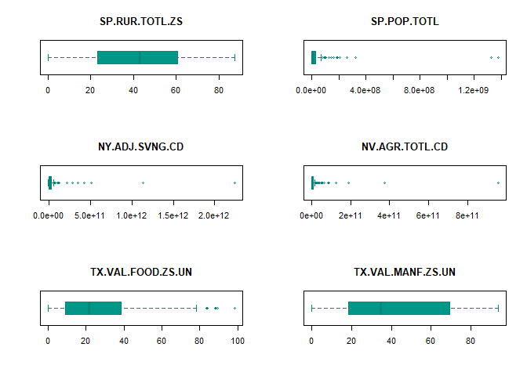
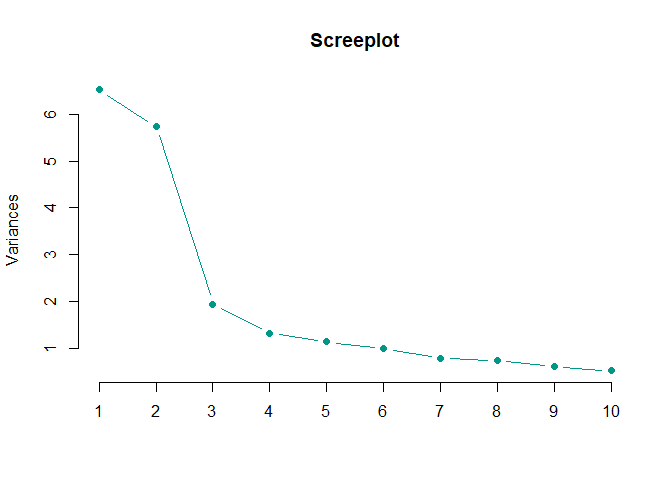
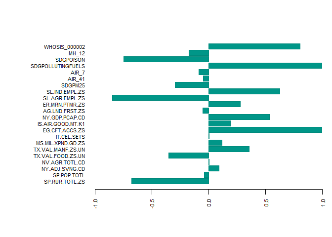

Índice de impacto al calentamiento global
================
Ludwig Rubio
Marzo de 2019

-   [Objetivo](#objetivo)
-   [Datos](#datos)
    -   [World Bank Data](#world-bank-data)
    -   [Global Health Observatory Data](#global-health-observatory-data)
-   [Preprocesamieto](#preprocesamieto)
    -   [WHO (GHOD)](#who-ghod)
    -   [Merge](#merge)
    -   [Tratamiento de Missing Values](#tratamiento-de-missing-values)
-   [Análisis Descriptivo](#análisis-descriptivo)
    -   [Concociendo los datos](#concociendo-los-datos)
    -   [Correlaciones](#correlaciones)
    -   [Outliers](#outliers)
-   [Análisis multivariante](#análisis-multivariante)
    -   [PCA](#pca)
    -   [Factor Analysis](#factor-analysis)
-   [Conclusiones](#conclusiones)

### Objetivo

Tras una exploración de la bases de datos **World Bank Data** y **WHO Global Health Observatory Data**, hemos definido como objetivo:

**Generar un índice de impacto al calentamiento global por país**, donde se puedan tomar en cuenta aspectos económicos, poblacionales, de salud y calidad de vida en general, tomando como eje causas y efectos del calentamiento global.

### Datos

La metodología seguida para la selección de variables fue la exploración de datos en los portales de manera manual, donde se acota (debido a la periodicidad de los datos), que nuestro objetivo se centre en un **índice del año 2016**, descartando un aproximado de 4 variables de *WHO* y *400* del Banco Mundial.

Para ver más detalles de la selección de variables, se pueden consultar los archivo adjuntos **Selección de variables \[BASE\_DE\_DATOS\].xls**.

#### World Bank Data

``` r
# Claves por base temática
wdb_pob <- c("SP.RUR.TOTL.ZS","SP.POP.TOTL","SP.URB.TOTL.IN.ZS");
wdb_develop <- c("NY.ADJ.SVNG.CD","EN.ATM.METH.AG.ZS","NV.AGR.TOTL.CD",
                 "ER.H2O.FWTL.ZS","NV.MNF.CHEM.ZS.UN","EG.USE.CRNW.ZS",
                 "EN.CLC.DRSK.XQ","EN.ATM.METH.EG.ZS","TX.VAL.FOOD.ZS.UN",
                 "EG.USE.COMM.FO.ZS","TX.VAL.MANF.ZS.UN","EN.ATM.METH.ZG",
                 "MS.MIL.XPND.GD.ZS","IT.CEL.SETS","SE.SEC.ENRR")
wdb_economic <- c("EG.CFT.ACCS.ZS","IS.AIR.GOOD.MT.K1","ER.H2O.FWTL.ZS",
                  "EN.ATM.CO2E.PC","EN.CLC.MDAT.ZS","NY.GDP.PCAP.CD",
                  "SH.MLR.INCD.P3","AG.LND.FRST.ZS","ER.MRN.PTMR.ZS",
                  "SH.STA.ODFC.ZS","IS.RRS.PASG.KM","SL.AGR.EMPL.ZS",
                  "SL.IND.EMPL.ZS")
wdb_columns <-  c(wdb_pob , wdb_develop, wdb_economic)

# Filtro por 2016, y sin datos extra (Latitud, Longitud, etc.)
wdb_data <- WDI(indicator = wdb_columns , start = 2016, end = 2016, extra = F) 
```

#### Global Health Observatory Data

``` r
# Obtenemos todos los códigos para realizar exploración sobre las variables 
#seleccionadas previamente
#modes <- get_codes()
who_columns <-  c("SDGPM25", "AIR_41", "AIR_7", "SDGPOLLUTINGFUELS",
                  "SDGPOISON", "MH_12", "WHOSIS_000002");
SDGPM25<-get_data('SDGPM25')
AIR_41<-get_data('AIR_41')
AIR_7<-get_data('AIR_7')
SDGPOLLUTINGFUELS<-get_data('SDGPOLLUTINGFUELS')
SDGPOISON<-get_data('SDGPOISON')
MH_12<-get_data('MH_12')
WHOSIS_000002<-get_data('WHOSIS_000002')
```

### Preprocesamieto

Para evitar un excesivo espacio ocupado se omiten todos los **summary**, **unique**, **table**, y otras impresiones que nos permiten conocer el comportamiento de de los datos.

#### WHO (GHOD)

Comenzaremos por limpiar cada variable proveniente de WHO, nuestro objetivo final será tener todas las variables en un formato *wide*.

##### Concentrations of fine particulate matter (PM2.5)

``` r
# Separando regiones para posibles consultas y agrupamientos
region_country = SDGPM25[! (is.na(SDGPM25$region) |  is.na(SDGPM25$country)),
                         c("region","country")]
region_country = region_country[!duplicated(region_country$country),]

# Quitando valores globales de mundo,regiones, etc. 
SDGPM25_clean = SDGPM25[!is.na(SDGPM25$country),]
SDGPM25_clean = SDGPM25_clean[SDGPM25_clean$residenceareatype == "Total",
                              c("country","value")]

# Removiendo intervalos de confianza
SDGPM25_clean$value = str_split_fixed(SDGPM25_clean$value, " ", 2)[,1]
```

##### Ambient air pollution attributable deaths

``` r
# Filtrando por el total de enfermedades y para ambos sexos ya que no es el
#objetivo hacerlo por género.
AIR_41_clean = AIR_41[AIR_41$sex == "Both sexes" & AIR_41$envcause == "Total",]
AIR_41_clean = AIR_41_clean[,c("country","value")]

# Removiendo intervalos de confianza
AIR_41_clean$value = str_split_fixed(AIR_41_clean$value, " ", 2)[,1]
```

##### Ambient air pollution attributable DALYs

``` r
# Filtrando por el total de enfermedades y para ambos sexos ya que no es el
#objetivo hacerlo por género.
AIR_7_clean = AIR_7[AIR_7$sex == "Both sexes" & AIR_7$envcause == "Total",]
AIR_7_clean = AIR_7_clean[,c("country","value")]

# Removiendo intervalos de confianza
AIR_7_clean$value = str_split_fixed(AIR_7_clean$value, " ", 2)[,1]
```

##### Proportion of population with primary reliance on clean fuels (%)

``` r
# Eliminamos aquellos registros con país como valor nulo y filtramos por año 2016
SDGPOLLUTINGFUELS_clean = SDGPOLLUTINGFUELS[(!is.na(SDGPOLLUTINGFUELS$country) 
                                             & SDGPOLLUTINGFUELS$year == 2016),]
# Filtramos solo el país y el valor deseado.
SDGPOLLUTINGFUELS_clean = SDGPOLLUTINGFUELS_clean[,c("country","value")]

# Paso lo valores de menor o mayor a su valor tope, para poder ser procesado,
# aunque exisita perdida de información no tenemos muchas opciones.
SDGPOLLUTINGFUELS_clean$value[SDGPOLLUTINGFUELS_clean$value == "<5"] <- "5"
SDGPOLLUTINGFUELS_clean$value[SDGPOLLUTINGFUELS_clean$value == ">95"] <-  "95"
# Aplico NA a los valores faltantes
SDGPOLLUTINGFUELS_clean$value[SDGPOLLUTINGFUELS_clean$value == "No data"] <- NA
```

##### Mortality rate attributed to unintentional poisoning (per 100 000 population)

``` r
# Eliminamos país como valor nulo y filtramos por año 2016 y valor "ambos sexos"
SDGPOISON_clean = SDGPOISON[ (!is.na(SDGPOISON$country)
                              & SDGPOISON$year == 2016
                              & SDGPOISON$sex == "Both sexes") ,]
# Filtramos solo el país y el valor deseado.
SDGPOISON_clean = SDGPOISON_clean[,c("country","value")]
```

##### Age-standardized suicide rates (per 100 000 population)

``` r
# Quitamos valores nulos en país y filtramos por ambos sexos y el año 2016
MH_12_clean = MH_12[ (!is.na(MH_12$country)) & MH_12$sex == "Both sexes"
                     & MH_12$year == 2016, ]
# Filtramos sólo el país y el valor de taza de suicidios
MH_12_clean = MH_12_clean[,c("country","value")]
```

##### Healthy life expectancy (HALE) at birth (years)

``` r
# Quitamos valores nulos en país y filtramos por ambos sexos y el año 2016
WHOSIS_000002_clean = WHOSIS_000002[ (!is.na(WHOSIS_000002$country))
                                     & WHOSIS_000002$sex == "Both sexes" 
                                     & WHOSIS_000002$year == 2016, ]
# Filtramos sólo el país y el valor de taza de suicidios
WHOSIS_000002_clean = WHOSIS_000002_clean[,c("country","value")]
```

#### Merge

Una vez realizado nuestro proceso de limpieza, vamos a unificar las variables en un mismo data frame, para lo que haremos uso de la función *merge*.

``` r
# Añadimos todas las variables a una lista
who_variables <- list( SDGPM25_clean, AIR_41_clean, AIR_7_clean,
                       SDGPOLLUTINGFUELS_clean, SDGPOISON_clean,
                       MH_12_clean, WHOSIS_000002_clean)

# Renombramos el nombre de su columna value, para pdoer hacer un merge
for (index in seq(1,7)) {
 colnames(who_variables[[index]]) <- c("country", who_columns[index])
}

# Merge todas nuestras variables
who_data = Reduce(function(x,y) merge(x,y , by="country", all = T),
                  who_variables)
```

Ahora mezclaremos ambas bases de datos a través del nombre del país.

``` r
# Mezclando ambas bases
data <- merge(wdb_data, who_data, by = "country", all.y= T)

# Obteniendo los países donde perdimos información
data$country[is.na(data$iso2c)]
```

    ##  [1] "Bahamas"                                             
    ##  [2] "Bolivia (Plurinational State of)"                    
    ##  [3] "Congo"                                               
    ##  [4] "Cook Islands"                                        
    ##  [5] "Côte d'Ivoire"                                       
    ##  [6] "Czechia"                                             
    ##  [7] "Democratic People's Republic of Korea"               
    ##  [8] "Democratic Republic of the Congo"                    
    ##  [9] "Egypt"                                               
    ## [10] "Gambia"                                              
    ## [11] "Iran (Islamic Republic of)"                          
    ## [12] "Kyrgyzstan"                                          
    ## [13] "Lao People's Democratic Republic"                    
    ## [14] "Micronesia (Federated States of)"                    
    ## [15] "Niue"                                                
    ## [16] "Republic of Korea"                                   
    ## [17] "Republic of Moldova"                                 
    ## [18] "Republic of North Macedonia"                         
    ## [19] "Saint Kitts and Nevis"                               
    ## [20] "Saint Lucia"                                         
    ## [21] "Saint Vincent and the Grenadines"                    
    ## [22] "Slovakia"                                            
    ## [23] "United Kingdom of Great Britain and Northern Ireland"
    ## [24] "United Republic of Tanzania"                         
    ## [25] "United States of America"                            
    ## [26] "Venezuela (Bolivarian Republic of)"                  
    ## [27] "Viet Nam"                                            
    ## [28] "Yemen"

Con el merge anterior perdimos los datos de 28 países. Tras un análisis de los errores remplazaremos manualmente los valores en la base de datos de *WHO* (considerando que al contener una clave ISO, los nombres más adecuados son los del Banco Mundial), para volver a realizar el merge sin perder países.

``` r
# Con estas líneas se análizaron las diferencias de nombres de país entre 
#las dos fuentes
#who_data[order(who_data$country),] #Valores sin correcto Match
#wdb_data[order(wdb_data$country),"country"] #Valores posibles

oldCountryNames =  c("Bahamas", "Bolivia (Plurinational State of)", "Congo", "Côte d'Ivoire", "Czechia", "Democratic People's Republic of Korea", "Democratic Republic of the Congo", "Egypt", "Gambia", "Iran (Islamic Republic of)", "Kyrgyzstan", "Lao People's Democratic Republic", "Micronesia (Federated States of)", "Republic of Korea", "Republic of Moldova", "Saint Kitts and Nevis", "Saint Lucia", "Saint Vincent and the Grenadines", "Slovakia", "Republic of North Macedonia", "United Kingdom of Great Britain and Northern Ireland", "United Republic of Tanzania", "United States of America", "Venezuela (Bolivarian Republic of)","Viet Nam","Yemen")

newCountryNames = c("Bahamas, The" ,"Bolivia", "Congo, Rep.", "Cote d'Ivoire", "Czech Republic", "Korea, Dem. People’s Rep.","Congo, Dem. Rep.","Egypt, Arab Rep.", "Gambia, The", "Iran, Islamic Rep.", "Kyrgyz Republic", "Lao PDR", "Micronesia, Fed. Sts.", "Korea, Rep.", "Moldova", "St. Kitts and Nevis", "St. Lucia", "St. Vincent and the Grenadines", "Slovak Republic", "North Macedonia", "United Kingdom", "Tanzania", "United States", "Venezuela, RB", "Vietnam", "Yemen, Rep.")


# Función para remplazar por nuevos nombres
changeNameCountry <- function ( dataFrame, arrayOld, arrayNew ){
  dataFrame$country[dataFrame$country %in% arrayOld ] <- arrayNew
  return (dataFrame)
}

# Aplicamos en nuestro set de datos de WHO así como en la variable de regiones
who_data <- changeNameCountry(who_data, oldCountryNames, newCountryNames);
region_country <- changeNameCountry(region_country, oldCountryNames,
                                    newCountryNames);

# Volvemos a realizar el merge
data <- merge(wdb_data, who_data, by = "country", all.y= T)

# Renombramos el error en el nombre de Korea de norte
data$country[data$country == "Korea, Dem. Peopleâ\200\231s Rep."] <- "Korea, Dem. Peoples Rep."
region_country$country[region_country$country == "Korea, Dem. Peopleâ\200\231s Rep."] <- "Korea, Dem. Peoples Rep."

# Obtenemos los valores missing que ya teníamos detectados
data[is.na(data$iso2c), "country"] 
```

    ## [1] "Cook Islands" "Niue"

Por lo que reducimos a sólo 2 países que no encontramos formas de mezclar de manera confiable.

Ahora cambiaremos el tipo de dato de algunas columnas que deberían ser de tipo numérico y se encuentran como tipo carácter, así como pasaremos a factor nuestras variables categóricas.

``` r
# Variables númericas
data$SDGPM25 <- as.numeric(data$SDGPM25)
data$AIR_41 <- as.numeric(data$AIR_41)
data$AIR_7 <- as.numeric(data$AIR_7)
data$SDGPOLLUTINGFUELS <- as.numeric(data$SDGPOLLUTINGFUELS)

# Variables categóricas como factores
data$country <- factor(data$country)
data$iso2c <- factor(data$iso2c)
```

Por último vamos a añadir a nuestros datos, la región para poder realizar exploraciones a través de regiones.

``` r
data = merge(data, region_country, by='country', all=TRUE)
data$region <- factor(data$region)
```

#### Tratamiento de Missing Values

##### Busqueda y eliminación

Buscaremos aquellos países cuyo valor de missing values este presente en por lo menos el 60% de todas las variables, considerando que el tratamiento de *missing values* en estos países sería una simulación demasiado forzada, pues no contaríamos ni con un mínimo que nos permita simular su comportamiento real.

``` r
# Obtenemos un mascara booleana de aquellos registros que tiene por lo menos el 60% de las columnas como missing values
country_nas <- apply(data, 1,
                     function(x) (sum(is.na(x)) / dim(data)[2]) * 100 ) >= 60
# Obtenemos 12 países
sum(country_nas)
```

    ## [1] 10

``` r
# Lista de países que no estarán en nuestro índice
data$country[country_nas]
```

    ##  [1] Andorra          Cook Islands     Dominica         Marshall Islands
    ##  [5] Monaco           Nauru            Niue             Palau           
    ##  [9] San Marino       Tuvalu          
    ## 194 Levels: Afghanistan Albania Algeria Andorra ... Zimbabwe

``` r
# Quitando países de nuestros datos
data <- data[!country_nas,]
```

Como segundo criterio de eliminación, vamos a remover aquellas columnas o variables, en el que sí tiene por lo menos el 30% de valores NA, será quitada de nuestro modelo, siguiendo el mismo comportamiento de la eliminación por filas.

``` r
# Obtenemos la proporción por ciento de NA en cada columna
nas_data <- sapply(data, function(x){
    ( sum(is.na(x)) / length(x) * 100)
})
nas_data <- nas_data[nas_data>=30] #18 variables

# Ponemos en null todas las variables con más de 30%
data[, names(nas_data) ] <- list(NULL)
# Borramos toda la columna year
data[, "year"] <- list(NULL)

# Variables eliminadas
print( names(nas_data))
```

    ##  [1] "ER.H2O.FWTL.ZS"    "EN.ATM.METH.AG.ZS" "NV.MNF.CHEM.ZS.UN"
    ##  [4] "EG.USE.CRNW.ZS"    "EN.CLC.DRSK.XQ"    "EN.ATM.METH.EG.ZS"
    ##  [7] "EG.USE.COMM.FO.ZS" "EN.ATM.METH.ZG"    "SE.SEC.ENRR"      
    ## [10] "EN.ATM.CO2E.PC"    "EN.CLC.MDAT.ZS"    "SH.MLR.INCD.P3"   
    ## [13] "SH.STA.ODFC.ZS"    "IS.RRS.PASG.KM"

Por lo que *16* de nuestras variables han sido eliminadas por no cumplir con valores en por lo menos el 70% de nuestros países seleccionados.

##### Tratamiento

Tras estas decisiones, debemos entonces realizar el tratamiento de *11 variables* que contienen NAs.

Como método, imputaremos el valor de la mediana de todos los países de la región a la que pertenece, ya que tras realizar el experimento imputando a la media, los valores outliers como China e India daban un valor muy exagerado a los países con missing values, debido a la susceptibilidad de la media a outliers.

``` r
# Añadimos región a Yemen
data$region[data$country=="Yemen, Rep."] = "South-East Asia"
data$region[data$country=="North Macedonia"] = "Europe"

# Obtenemos todas las variables que contienen NA
varWithNa <- colnames(data)[colSums(is.na(data)) > 0]

# Iteramos por cada variable con NA's
for(index in seq(1,length(varWithNa))){
  
 # Obtenemos la media por región
  actualVarMeanByRegion <- data[!is.na(data[varWithNa[index]]),
                                c("region",
                                  varWithNa[index])] %>%
                                  group_by(region) %>%
                                  dplyr::summarise_all(funs(mean = median))
  
  # Obtenemos los índices de las filas con NA para la variable actual
  nAInVar <- rownames(data[is.na(data[varWithNa[index]]),])
  # Para cada uno, obtenemos el valor de la media de la región a la que pertenece
  sapply(nAInVar, function(i){
    data[i,varWithNa[index]] <<- actualVarMeanByRegion$mean[actualVarMeanByRegion$region == data[i,"region"]]
  })
}
```

    ## Warning: funs() is soft deprecated as of dplyr 0.8.0
    ## please use list() instead
    ## 
    ## # Before:
    ## funs(name = f(.)
    ## 
    ## # After: 
    ## list(name = ~f(.))
    ## This warning is displayed once per session.

``` r
colSums(is.na(data)) 
```

    ##           country             iso2c    SP.RUR.TOTL.ZS       SP.POP.TOTL 
    ##                 0                 0                 0                 0 
    ## SP.URB.TOTL.IN.ZS    NY.ADJ.SVNG.CD    NV.AGR.TOTL.CD TX.VAL.FOOD.ZS.UN 
    ##                 0                 0                 0                 0 
    ## TX.VAL.MANF.ZS.UN MS.MIL.XPND.GD.ZS       IT.CEL.SETS    EG.CFT.ACCS.ZS 
    ##                 0                 0                 0                 0 
    ## IS.AIR.GOOD.MT.K1    NY.GDP.PCAP.CD    AG.LND.FRST.ZS    ER.MRN.PTMR.ZS 
    ##                 0                 0                 0                 0 
    ##    SL.AGR.EMPL.ZS    SL.IND.EMPL.ZS           SDGPM25            AIR_41 
    ##                 0                 0                 0                 0 
    ##             AIR_7 SDGPOLLUTINGFUELS         SDGPOISON             MH_12 
    ##                 0                 0                 0                 0 
    ##     WHOSIS_000002            region 
    ##                 0                 0

Ahora tenemos listo nuestros datos, sin NA y en los formatos que necesitamos, y aunque no es lo adecuado, dejaremos posibles casos de Outliers a corregir en el análisis descriptivo, aprovechando el conocimiento adquirido de nuestros datos a través del análisis descriptivo.

### Análisis Descriptivo

Pasamos de 40 a solo **21 variables** (numéricas), y de 194 a **182 países**, debido a la mala calidad de los datos y compatibilidad entre las fuentes de datos.

#### Concociendo los datos

``` r
# Dimensión
dim(data)
```

    ## [1] 184  26

``` r
# Datos
str(data)
```

    ## 'data.frame':    184 obs. of  26 variables:
    ##  $ country          : Factor w/ 194 levels "Afghanistan",..: 1 2 3 5 6 7 8 9 10 11 ...
    ##  $ iso2c            : Factor w/ 192 levels "AD","AE","AF",..: 3 5 49 7 4 8 6 10 9 11 ...
    ##  $ SP.RUR.TOTL.ZS   : num  75 41.6 28.5 35.9 75.2 ...
    ##  $ SP.POP.TOTL      : num  34656032 2876101 40606052 28813463 100963 ...
    ##  $ SP.URB.TOTL.IN.ZS: num  25 58.4 71.5 64.1 24.8 ...
    ##  $ NY.ADJ.SVNG.CD   : num  6.63e+08 9.92e+08 3.60e+10 -1.32e+10 8.60e+09 ...
    ##  $ NV.AGR.TOTL.CD   : num  4.02e+09 2.37e+09 1.96e+10 9.94e+09 2.26e+07 ...
    ##  $ TX.VAL.FOOD.ZS.UN: num  56.92 8.24 1.1 38.32 54.77 ...
    ##  $ TX.VAL.MANF.ZS.UN: num  6.56 66.31 4.62 18.48 34.71 ...
    ##  $ MS.MIL.XPND.GD.ZS: num  0.955 1.103 6.424 2.642 1.164 ...
    ##  $ IT.CEL.SETS      : num  21602982 3369756 47041321 13001124 180000 ...
    ##  $ EG.CFT.ACCS.ZS   : num  32.4 77.4 92.6 48 98.8 ...
    ##  $ IS.AIR.GOOD.MT.K1: num  29.011 40.46 21.591 43.94 0.549 ...
    ##  $ NY.GDP.PCAP.CD   : num  550 4132 3943 3510 14507 ...
    ##  $ AG.LND.FRST.ZS   : num  2.068 28.122 0.824 46.307 22.273 ...
    ##  $ ER.MRN.PTMR.ZS   : num  0.70142 2.71443 0.08528 0.00486 0.19172 ...
    ##  $ SL.AGR.EMPL.ZS   : num  38.82 39.79 8.34 49.44 15.21 ...
    ##  $ SL.IND.EMPL.ZS   : num  17.42 18.98 31.18 8.23 19.54 ...
    ##  $ SDGPM25          : num  53.2 17.9 35.2 27.9 17.9 11.8 30.5 7.2 12.4 18.2 ...
    ##  $ AIR_41           : num  17143 1855 14192 8706 27 ...
    ##  $ AIR_7            : num  810565 37856 400700 506561 616 ...
    ##  $ SDGPOLLUTINGFUELS: num  32 77 93 48 95 95 95 95 95 95 ...
    ##  $ SDGPOISON        : num  1.2 0.4 0.8 2.7 0.4 0.6 0.6 0.2 0.2 0.6 ...
    ##  $ MH_12            : num  6.4 5.6 3.3 8.9 0.5 9.1 5.7 11.7 11.4 2.6 ...
    ##  $ WHOSIS_000002    : num  53 68.1 65.5 55.8 67 68.4 66.3 73 72.4 64.9 ...
    ##  $ region           : Factor w/ 6 levels "Africa","Americas",..: 3 4 1 1 2 2 4 6 4 4 ...

``` r
# Variables categóricas
col_categoric = colnames(data[,c(1,2,26)])

# Variables numéricas
col_numeric = colnames(data[,-c(1,2,26)])
```

#### Correlaciones

``` r
R = cor(data[,col_numeric],use="complete.obs")
det(R)
```

    ## [1] -1.195223e-45

El determinante nos da negativo, nos puede indicar un problema con nuestras variables, ¿Qué nos dice nuestra covarianza?

``` r
S = cov(data[,col_numeric],use="complete.obs")
det(S)
```

    ## [1] -6.947407e+103

El determinante de nuestra matriz de covarianza indica que tenemos una correlación perfecta en alguna de nuestras variables, podríamos creer que se trata de las variables de población urbana y población rural debido que son complementarías. Quitaremos alguna de las dos:

``` r
# Retiramos población rural
R = cor(data[,col_numeric[-3]],use="complete.obs") #Quitamos población urbana
det(R)
```

    ## [1] 8.40022e-15

Ahora podemos proseguir, lamentablemente contamos con variables altamente correladas después de realizar la limpieza de variables, pero por lo menos al no tener una matriz singular, ahora podemos obtener los autovalores y autovector a través de la inversa de la matriz.

``` r
# Quitamos de nuestros ínidice la variable de población urbana defintivamente
col_numeric = col_numeric[-3]

# ¿Correlación entre variables?
corrplot(R, type = "upper", tl.col="#666666", tl.cex = .6)
```


``` r
heatmap(R, symm = TRUE)
```


``` r
# No es fácil percibir las relaciones sin embargo se observan algunos patrones.
pairs(data[,col_numeric],  pch=20, col = data$region)
```


Se observan algunas correlaciones fuertes entre variables, por ejemplo:

-   Una correlación positiva entre la expectativa de vida sana y el porcentaje de combustible renovable que se usa respecto al total de energía.
-   Una correlación positiva entre la calidad del aire, y la cantidad de población.
-   Una correlación entre las emisiones de contaminantes por combustibles y la expectativa de vida.

Y otras que parecen a primera vista un poco extrañas como:

-   Una correlación positiva entre el número de personas que usan el móvil y la calidad del aire.

También podemos observar relaciones lineales, cuadráticas y logarítmicas entre variables de forma muy clara, algunas son:

-   Empleo industrial - Empleo en agricultura
-   Expectativa de vida - Envenenamiento por contaminación
-   Expectativa de vida - Exposición a aíre contaminado

Ahora intentaremos visualizar las relaciones múltiples entre nuestras variables, obteniendo la matriz inversa de nuestra matriz de correlaciones.

``` r
iR <- solve(R)
igraph.f<-graph.adjacency(iR, weighted=TRUE, mode="lower", diag=F)
plot.igraph(igraph.f, edge.width=1,vertex.size=10)
```


Parece que la información no es muy clara, pero nos damos una idea de las múltiples relaciones existentes.

##### Variabilidad

``` r
S = cov(data[,col_numeric],use="complete.obs")

det(S)
```

    ## [1] 6.393307e+131

``` r
sum(diag(S))
```

    ## [1] 4.355993e+22

Por lo que podemos observar que la variabilidad de las unidades es amplia, y tendremos que realizar un escalado en nuestros datos.

##### Normalidad

``` r
X <- as.matrix(data[,col_numeric])
n <- dim(data[,col_numeric])[1]
p <- dim(data[,col_numeric])[2]

muhat = colMeans(X)
# Añadimos una tolerencia mayor, para que no se interprete como matriz singular
dM2 <- mahalanobis(X, muhat, S, tol=1e-29)

qqplot(dM2, qchisq(ppoints(n), df = p), xlab="Quantiles de distancia Mahalanobis",
       ylab="Quantiles para Chi-square (con 'p' df)", pch=21, col="#880E4F",
       main = expression("Q-Q plot de" ~~ {chi^2}[p]))
qqline(dM2, distribution = function(q) qchisq(q, df = p), col = "#009688")
```


Debido al comportamiento de nuestras distancias, se puede observar claros Outliers, pero además podríamos decir que no sigue una normal.

#### Outliers

``` r
par(mfrow=c(3,2))

invisible(sapply(col_numeric, function(x) { 
  boxplot(data[,x], main= x, col = "#009688",
          border = "#00897B", horizontal = T)}))
```



Exploraremos algunos aspectos buscando respuestas respecto al origen de estos Outliers.Ya que todos los outliers parecen estar por encima del bigote superior (y ninguno inferior), obtendremos las datos que estén por encima del valor del tercer cuartil, sumando 1.5 veces el valor de Rango Intercuartílico.

**¿Son China e India algunos de los países con Outliers Población Total?**

``` r
qnt <- quantile(data$SP.POP.TOTL, probs=c(.25, .75))
outliers <- data[data$SP.POP.TOTL > qnt[2] + 1.5*IQR(data$SP.POP.TOTL),
                 c("country","SP.POP.TOTL")]
outliers[order(outliers$SP.POP.TOTL, decreasing = T),]
```

    ##                country SP.POP.TOTL
    ## 36               China  1378665000
    ## 78               India  1324171354
    ## 186      United States   323071342
    ## 79           Indonesia   261115456
    ## 24              Brazil   207652865
    ## 133           Pakistan   193203476
    ## 128            Nigeria   185989640
    ## 14          Bangladesh   162951560
    ## 144 Russian Federation   144342396
    ## 112             Mexico   127540423
    ## 86               Japan   126994511
    ## 139        Philippines   103320222
    ## 59            Ethiopia   102403196
    ## 53    Egypt, Arab Rep.    95688681
    ## 191            Vietnam    94569072
    ## 66             Germany    82348669
    ## 80  Iran, Islamic Rep.    80277428
    ## 179             Turkey    79512426
    ## 39    Congo, Dem. Rep.    78736153
    ## 173           Thailand    68863514

Sí, y todos los países obtenidos están en la lista de los 20 países más poblados del mundo.

**¿Es posible la exsitencia de Outliers tan pronunciada en valor agregado total en Agricultura (*NV.AGR.TOTL.CD*)?**

``` r
qnt <- quantile(data$NV.AGR.TOTL.CD, probs=c(.25, .75))
outliers <- data[data$NV.AGR.TOTL.CD > qnt[2] + 1.5*IQR(data$NV.AGR.TOTL.CD),
                 c("country","region","NV.AGR.TOTL.CD")]
outliers[order(outliers$NV.AGR.TOTL.CD, decreasing = T),]
```

    ##                country                region NV.AGR.TOTL.CD
    ## 36               China       Western Pacific   958278275265
    ## 78               India       South-East Asia   372190852855
    ## 186      United States              Americas   188937833000
    ## 79           Indonesia       South-East Asia   125605406684
    ## 24              Brazil              Americas    87891946116
    ## 128            Nigeria                Africa    84908054292
    ## 133           Pakistan Eastern Mediterranean    64690228085
    ## 86               Japan       Western Pacific    56932943210
    ## 179             Turkey                Europe    53410357273
    ## 144 Russian Federation                Europe    49296812986
    ## 80  Iran, Islamic Rep.                Africa    40378317245
    ## 53    Egypt, Arab Rep.       Western Pacific    39183328652
    ## 112             Mexico              Americas    36102367540
    ## 62              France                Europe    35754141626
    ## 7            Argentina              Americas    35255332554
    ## 84               Italy                Europe    35178500278
    ## 173           Thailand       South-East Asia    35018812117
    ## 191            Vietnam       Western Pacific    33500340698
    ## 161              Spain                Europe    33290741775
    ## 14          Bangladesh       South-East Asia    31098972568
    ## 166              Sudan Eastern Mediterranean    29822314010
    ## 139        Philippines       Western Pacific    29437550858
    ## 9            Australia       Western Pacific    29362352599
    ## 92         Korea, Rep.       Western Pacific    27271707278
    ## 105           Malaysia       Western Pacific    25679917074
    ## 59            Ethiopia                Africa    25371672848
    ## 66             Germany                Europe    23288918040
    ## 89               Kenya                Africa    22775988036
    ## 3              Algeria                Africa    19556326529
    ## 37            Colombia              Americas    18557872137

Parecen lógico debido a su tamaño territorial y cantidad de población, siendo además China e India los que tiene mayor valor agregado, lo que se puede observar.

**¿Es posible que alguien tenga casi el 100 de mercado de exportación de alimientos (*TX.VAL.FOOD.ZS.UN*)?**

``` r
qnt <- quantile(data$TX.VAL.FOOD.ZS.UN, probs=c(.25, .75))
outliers <- data[data$TX.VAL.FOOD.ZS.UN > qnt[2] + 1.5*IQR(data$TX.VAL.FOOD.ZS.UN),
                 c("country","region","TX.VAL.FOOD.ZS.UN")]
outliers[order(outliers$TX.VAL.FOOD.ZS.UN, decreasing = T),]
```

    ##                            country          region TX.VAL.FOOD.ZS.UN
    ## 106                       Maldives South-East Asia          98.55777
    ## 152                     Seychelles          Africa          89.46247
    ## 148          Sao Tome and Principe          Africa          88.44718
    ## 165 St. Vincent and the Grenadines          Europe          87.96885
    ## 59                        Ethiopia          Africa          83.82269
    ## 104                         Malawi          Africa          83.72755
    ## 29                      Cabo Verde          Africa          83.57011

En este caso resulta complicado corroborar los datos, no fue posible encontrar fuentes de datos con las cuales contrastar dichos valores, pero a primera impresión *parecen probables errores*, en algunos derivados de la imputación a la mediana.

**¿Es posibile que algún país tenga caso el 100% de sus aguas marinas como protegidas (*ER.MRN.PTMR.ZS*)?**

``` r
qnt <- quantile(data$ER.MRN.PTMR.ZS, probs=c(.25, .75))
outliers <- data[data$ER.MRN.PTMR.ZS > qnt[2] + 1.5*IQR(data$ER.MRN.PTMR.ZS),
                 c("country","region","ER.MRN.PTMR.ZS")]
#Obtenemos los primero 4 para consultar los países con más áreas marinas protegidas.
outliers[order(outliers$ER.MRN.PTMR.ZS, decreasing= T),][1:4,]
```

    ##           country          region ER.MRN.PTMR.ZS
    ## 156      Slovenia          Europe      100.00000
    ## 66        Germany          Europe       45.35655
    ## 186 United States        Americas       41.08292
    ## 9       Australia Western Pacific       40.65344

Eslovenia, cuenta con un pequeño territorio marino, con una protección del 99.86%, por lo que se puede confirmar que el dato es verdadero. Fuente: <http://www.mpatlas.org/region/country/SVN/>

### Análisis multivariante

En esta sección utilizaremos algunas herramientas de análisis multivariante, para llegar a nuestro objetivo.

Primeramente transformamos a forma logarítmica algunas variables que debido a su población inmensa o tamaño territorial, fuera de lo común, tiene valores outliers:

``` r
data_pca = data[,col_numeric]
data_pca[col_numeric[c(2,3,6,7,9,10,11,13,14,15,16,18,19)]] = 
  log(data[,col_numeric[c(2,3,6,7,9,10,11,13,14,15,16,18,19)]])
```

    ## Warning in FUN(X[[i]], ...): Se han producido NaNs

#### PCA

Aplicamos un análisis de componentes principales, centramos a cero y escalamos.

``` r
pca = prcomp(data[,col_numeric], center=TRUE, scale=TRUE)

summary(pca)
```

    ## Importance of components:
    ##                           PC1    PC2     PC3     PC4     PC5     PC6
    ## Standard deviation     2.5537 2.3974 1.39527 1.15049 1.06596 0.99636
    ## Proportion of Variance 0.2964 0.2612 0.08849 0.06017 0.05165 0.04512
    ## Cumulative Proportion  0.2964 0.5577 0.64615 0.70632 0.75797 0.80309
    ##                            PC7     PC8     PC9    PC10    PC11   PC12
    ## Standard deviation     0.88769 0.85749 0.77563 0.72008 0.61534 0.5801
    ## Proportion of Variance 0.03582 0.03342 0.02735 0.02357 0.01721 0.0153
    ## Cumulative Proportion  0.83891 0.87233 0.89968 0.92325 0.94046 0.9557
    ##                           PC13    PC14    PC15    PC16    PC17    PC18
    ## Standard deviation     0.54024 0.46019 0.42015 0.37103 0.30830 0.17845
    ## Proportion of Variance 0.01327 0.00963 0.00802 0.00626 0.00432 0.00145
    ## Cumulative Proportion  0.96902 0.97865 0.98667 0.99293 0.99725 0.99870
    ##                           PC19    PC20    PC21    PC22
    ## Standard deviation     0.13364 0.06922 0.06144 0.04775
    ## Proportion of Variance 0.00081 0.00022 0.00017 0.00010
    ## Cumulative Proportion  0.99951 0.99972 0.99990 1.00000

Podemos observar que las primeras dos componentes describen más del 50% de nuestra varianza total de los datos, utilizaremos in screeplot y el criterio de codo para tomar el número de componentes:

``` r
screeplot(pca,main="Screeplot",col="#009688",type="lines",pch=19)
```



Se observa que tomar los primeros 3 componentes sería el más indicado, más necesitamos comprender que está describiendo cada componente, para poder transmitir de forma clara nuestro índice.

##### Descripción de componentes principales

``` r
par(mar=c(5,10,4,1))
barplot(pca$rotation[,1], las=2, col="#009688", border = "#00897B",
        cex.names= .7, cex.axis=.7, horiz=TRUE)
```


Esta primer componente parece sencilla de interpretar, podemos observar de un lado todas las variables que fueron seleccionadas como posibles causantes del calentamiento global como lo son: Expectativa de vida sana (más se vive, más tiempo se contamina), industria, dependencia y acceso a tecnologías (sin importar que estas sean de tipo renovables, pues son creadoras de contaminantes de cualquier forma), uso de dispositivos móviles, exportación de comida, población en general y manufactura industrial.

Por el otro lado, se observa el contrapeso que mitiga el calentamiento global que son población rural, trabajo rural, y disminución de la población que se traduce en: suicidios, envenenamiento y exposición a aire contaminado.

Se puede observar que un cantidad considerable de variables que fueron incluidas con el objetivo de dar un sentido de disminución de calidad o expectativa de vida, tomaron un sentido distinto aquí, ya que puede ser interpretadas por la relación que guardan con variables del mismo signo como mitigadores.

A esta componente le llamaremos **Impacto o aporte al calentamiento global**.

``` r
par(mar=c(5,10,4,1))
barplot(pca$rotation[,2], las=2, col="#009688", border = "#00897B",
        cex.names= .7, cex.axis=.7, horiz=TRUE)
```


En esta nueva componente se observa un agrupamiento distinto, por un lado vemos expectativa de vida sana, dependencia de tecnologías y combustible limpios, PIB, porcentaje de áreas marinas protegidas, acceso a tecnologías limpias para cocinas y exportación de comida.

Por el otro lado población, aíre contaminado, exposición a aire contaminado, empleos industriales y agrícolas, transporte aéreo, uso de dispositivos móviles, manufactura, etc.

Este componente es más complicado de interpretar, pero sí tomamos en cuenta las dimensiones de las variables, podríamos decir que se trata de un componente que toma más en cuenta lo económico, por un lado las alternativas que disminuyen en calentamiento global, así como resultantes de la actividad económica, y por el otro efectos, **población** y actividades económicas que aportan más al calentamiento global.

A esta componente le llamaremos **Desarrollo sostenible - Economia **.

``` r
par(mar=c(5,10,4,1))
barplot(pca$rotation[,3], las=2, col="#009688" , border = "#00897B",
        cex.names= .7, cex.axis=.7, horiz=TRUE)
```


Este factor no es fácil de interpretar, sus variables no tiene mucho en común para nuestro objetivo. La variable con mayor dimensión es el porcentaje de PIB asociado a militarización, una variable que añadida como experimental o complementaria, por lo que **vamos a descartar esta componente como parte de la descripción de nuestro índice**.

¿Cómo están de dispersos los datos?

``` r
biplot(pca)
```


Parece que tenemos tres países con un comportamiento distinto a la mayoría, todos por aporte de la segunda componente (Economía - Población).

##### Representación del índice

Vamos a visualizar nuestro índice con distintos criterios, buscando encontrar algún insight interesante.

**¿Está nuestro índice asociado por región?**

``` r
# Añadimos una pequeño constante y proyectamos logaritmo para separales un poco.
qplot(log(pca$x[,1]+8),log(pca$x[,2]+8),col=data$region,
      label=data$iso2c, size=I(.1)) + 
  labs(title="Índice de aporte al calentamiento global",
       x="Calentamiento Global",
       y="Población - Economía", color="Region") +
  theme_bw() + theme(legend.position="bottom") +
  geom_text(size=2, hjust=.4, vjust=-.4, check_overlap = TRUE)
```

    ## Warning in log(pca$x[, 2] + 8): Se han producido NaNs

    ## Warning in log(pca$x[, 2] + 8): Se han producido NaNs

    ## Warning in log(pca$x[, 2] + 8): Se han producido NaNs

    ## Warning: Removed 2 rows containing missing values (geom_point).

    ## Warning: Removed 2 rows containing missing values (geom_text).


Sí, aún cuando hay casos particulares como lo son China, India y Estados Unidos que se separan de los grupos, África, América y Europa tienen un claro comportamiento de agrupación.

**¿Están los suicidios relacionados al calentamiento global?**

``` r
data.frame(z1=pca$x[,1],z2=data_pca$MH_12) %>% 
  ggplot(aes(z1,z2,label=data$country,color=data_pca$MH_12))+ 
  geom_point(size=0) +
  labs(title="Suicidios por calentamiento global",
       x="Calentamiento global",
       y="Taza de suicidios", color="Suicidios") +
  scale_color_gradient(low="#C5CAE9", high="#1A237E") +
  theme_bw() + theme(legend.position="bottom") +
  geom_text(size=2, hjust=0.6, vjust=0, check_overlap = TRUE)
```


No parecen tener una relación clara, los datos **no tienen un patrón claro** que nos permita conocer una relación lineal o de otro tipo.

**¿Los países que más aportan al calentamiento global tienen una relación a su PIB?**

``` r
data.frame(z1=pca$x[,1],z2=data_pca$NY.GDP.PCAP.CD) %>% 
  ggplot(aes(z1,z2,label=data$country,color=data_pca$NY.GDP.PCAP.CD)) +
  geom_point(size=0) +
  labs(title="PIB (Aporte al calentamiento global)",
       x="Calentamiento global", y="PIB", color="PIB") +
  scale_color_gradient(low="#F8BBD0", high="#880E4F") +
  theme_bw() + theme(legend.position="bottom") +
  geom_text(size=2, hjust=0.6, vjust=0, check_overlap = TRUE)
```


Podría decirse que sí tiene una relación, el patrón de la relación es muy claro, de **tipo lineal**. (Recordando que se realizó una transformación logarítmica sobre las variables, por lo que la relación lineal es en realidad de tipo logarítmica (-1/log(x))).

**¿Las población rural tienen una relación respecto al calentamiento global?**

``` r
data.frame(z1=pca$x[,1],z2=data_pca$SP.RUR.TOTL.ZS) %>% 
  ggplot(aes(z1,z2,label=data$country,color=data_pca$SP.RUR.TOTL.ZS)) +
  geom_point(size=0) +
  labs(title="Población rural - Calentamiento Global",
       x="Calentamiento global",
       y="Población rural", color="Población rural") +
  scale_color_gradient(low="#B2EBF2", high="#006064") +
  theme_bw() + theme(legend.position="bottom") +
  geom_text(size=2, hjust=0.6, vjust=0, check_overlap = TRUE)
```


No es del todo claro, pero se podría decir que existe una **relación lineal negativa**, que se traduciría como algo que mitiga el calentamiento global.

**¿Tiene relación la inversión en Militarización de un país con el calentamiento Global?**

``` r
data.frame(z1=pca$x[,1],z2=data_pca$MS.MIL.XPND.GD.ZS) %>% 
  ggplot(aes(z1,z2,label=data$country,color=data_pca$MS.MIL.XPND.GD.ZS)) +
  geom_point(size=0) +
  labs(title="Militarización - Calentamiento Global",
       x="Calentamiento global",
       y="Inversión en militarización", color="Militarización") +
  scale_color_gradient(low="#DCEDC8", high="#33691E") +
  theme_bw() + theme(legend.position="bottom") +
  geom_text(size=2, hjust=0.6, vjust=0, check_overlap = TRUE)
```


A primera vista pareciera que sí tiene una relación lineal, sin embargo debemos recordar que la variable se encuentra transformada logarítmicamente, y que existen valores en 0, que están empujando a los demás valores en el gráfico, si quitamos la transformación **no se observa un patrón claro**.

**Mapa del índice**

``` r
# Haciendo match entre nuestros datos y los países de representación en el mapa.
matched <- joinCountryData2Map(data.frame(country=data$country, 
                                          global=pca$x[,1]), 
                               joinCode="NAME", 
                               nameJoinColumn="country")
```

    ## 179 codes from your data successfully matched countries in the map
    ## 5 codes from your data failed to match with a country code in the map
    ## 64 codes from the map weren't represented in your data

``` r
# Plot del mapa
mapCountryData(matched, nameColumnToPlot="global",
               mapTitle="Aporte al calentamiento Global", 
               catMethod = "pretty", 
               colourPalette = c("#FDEA6F","#F3B355",
                                 "#E97E3B","#CF4F29","#723C2C"))
```

    ## You asked for 7 categories, 9 were used due to pretty() classification

    ## Warning in rwmGetColours(colourPalette, numColours): 5 colours specified
    ## and 9 required, using interpolation to calculate colours


#### Factor Analysis

Ahora utilizaremos un análisis factorial, y compararemos el resultado obtenido a través de componentes principales.

Debido a que el error no es representativo para nosotros, utilizaremos una rotación *varimax* y elegiremos el número de factores de manera intuitiva, esperando que describa lo suficiente nuestras variables.

Utilizaremos sólo dos factores para buscar su interpretación.

``` r
data_factor = data[,col_numeric]
data.f <- factanal(data_factor, factors = 2, rotation="varimax",
                   scores="regression", lower = 0.01)
data.f
```

    ## 
    ## Call:
    ## factanal(x = data_factor, factors = 2, scores = "regression",     rotation = "varimax", lower = 0.01)
    ## 
    ## Uniquenesses:
    ##    SP.RUR.TOTL.ZS       SP.POP.TOTL    NY.ADJ.SVNG.CD    NV.AGR.TOTL.CD 
    ##             0.545             0.010             0.376             0.137 
    ## TX.VAL.FOOD.ZS.UN TX.VAL.MANF.ZS.UN MS.MIL.XPND.GD.ZS       IT.CEL.SETS 
    ##             0.855             0.833             0.985             0.022 
    ##    EG.CFT.ACCS.ZS IS.AIR.GOOD.MT.K1    NY.GDP.PCAP.CD    AG.LND.FRST.ZS 
    ##             0.010             0.775             0.715             0.995 
    ##    ER.MRN.PTMR.ZS    SL.AGR.EMPL.ZS    SL.IND.EMPL.ZS           SDGPM25 
    ##             0.923             0.282             0.593             0.872 
    ##            AIR_41             AIR_7 SDGPOLLUTINGFUELS         SDGPOISON 
    ##             0.029             0.066             0.010             0.440 
    ##             MH_12     WHOSIS_000002 
    ##             0.969             0.352 
    ## 
    ## Loadings:
    ##                   Factor1 Factor2
    ## SP.RUR.TOTL.ZS            -0.675 
    ## SP.POP.TOTL        0.996         
    ## NY.ADJ.SVNG.CD     0.784         
    ## NV.AGR.TOTL.CD     0.929         
    ## TX.VAL.FOOD.ZS.UN -0.152  -0.349 
    ## TX.VAL.MANF.ZS.UN  0.198   0.358 
    ## MS.MIL.XPND.GD.ZS          0.119 
    ## IT.CEL.SETS        0.989         
    ## EG.CFT.ACCS.ZS             0.996 
    ## IS.AIR.GOOD.MT.K1  0.435   0.189 
    ## NY.GDP.PCAP.CD             0.534 
    ## AG.LND.FRST.ZS                   
    ## ER.MRN.PTMR.ZS             0.277 
    ## SL.AGR.EMPL.ZS            -0.848 
    ## SL.IND.EMPL.ZS     0.136   0.623 
    ## SDGPM25            0.206  -0.293 
    ## AIR_41             0.984         
    ## AIR_7              0.962         
    ## SDGPOLLUTINGFUELS          0.996 
    ## SDGPOISON                 -0.748 
    ## MH_12                     -0.172 
    ## WHOSIS_000002              0.804 
    ## 
    ##                Factor1 Factor2
    ## SS loadings      5.664   5.550
    ## Proportion Var   0.257   0.252
    ## Cumulative Var   0.257   0.510
    ## 
    ## Test of the hypothesis that 2 factors are sufficient.
    ## The chi square statistic is 1744.86 on 188 degrees of freedom.
    ## The p-value is 3.83e-250

El p-valor nos indica que dos factores son suficientes para describir nuestras variables.

**¿Qué se oberva en su varabilidad única?**

``` r
cbind(data.f$loadings, data.f$uniquenesses)
```

    ##                        Factor1      Factor2           
    ## SP.RUR.TOTL.ZS     0.011295908 -0.674500272 0.54512173
    ## SP.POP.TOTL        0.995883619 -0.036903506 0.01000000
    ## NY.ADJ.SVNG.CD     0.784290491  0.092454786 0.37633000
    ## NV.AGR.TOTL.CD     0.929101615  0.003605069 0.13673818
    ## TX.VAL.FOOD.ZS.UN -0.152186605 -0.348993641 0.85539796
    ## TX.VAL.MANF.ZS.UN  0.197762968  0.358122973 0.83277076
    ## MS.MIL.XPND.GD.ZS  0.030559231  0.119381052 0.98495638
    ## IT.CEL.SETS        0.988862298  0.006045424 0.02211456
    ## EG.CFT.ACCS.ZS     0.001054629  0.996149539 0.01000000
    ## IS.AIR.GOOD.MT.K1  0.434829506  0.189421541 0.77513680
    ## NY.GDP.PCAP.CD    -0.016139876  0.533551756 0.71465423
    ## AG.LND.FRST.ZS    -0.049588281 -0.052045368 0.99468341
    ## ER.MRN.PTMR.ZS     0.017756864  0.277367824 0.92316640
    ## SL.AGR.EMPL.ZS     0.004917133 -0.847644291 0.28161042
    ## SL.IND.EMPL.ZS     0.136373439  0.623407998 0.59286290
    ## SDGPM25            0.205871264 -0.292584612 0.87246521
    ## AIR_41             0.984104549 -0.045493513 0.02946859
    ## AIR_7              0.962349128 -0.086860895 0.06634050
    ## SDGPOLLUTINGFUELS  0.000155153  0.995718601 0.01000000
    ## SDGPOISON          0.041567190 -0.747507845 0.43952717
    ## MH_12              0.040987744 -0.172358356 0.96905629
    ## WHOSIS_000002      0.040401001  0.803827155 0.35211142

Las variables como lo son *taza de suicidio*, *áreas marinas protegidas* o *exportaciones (alimento y manufactura)*, tienen una variabilidad independiente muy alta, por lo que resultan poco relevantes para los factores.

Se puede observar como el acceso a combustibles y tecnologías limpias tiene un gran peso en el primer factor, y la población y contaminantes en el segundo factor.

Ahora vamos a gratificar para intentar realizar una interpretación:

``` r
par(mar=c(5,10,4,1))
barplot(data.f$loadings[,1], las=2, col="#009688",
        border = "#00897B", cex.names= .7, cex.axis=.7,
        horiz=TRUE,  xlim = c(-1, 1))
```


La interpretación del primer factor resulta complicada, sin embargo, todo lo fue seleccionado como un efecto del calentamiento global y datos de contexto rural, están de un lado, y todos los factores económicos, industrialización, manufactura, uso de tecnologías (posibles variables que aportan al calentamiento), del otro lado.

Asignarle un nombre es complicado, pero se distingue con claridad la relación antes descrita.

``` r
par(mar=c(5,10,4,1))
barplot(data.f$loadings[,2], las=2, col="#009688",
        border = "#00897B", cex.names= .7, cex.axis=.7,
        horiz=TRUE,  xlim = c(-1, 1))
```



Aún más difícil de interpretar, no se encuentra un relación clara entre los valores negativos y positivos, pero se puede ver claramente el peso que tiene la población y sus efectos en los valores positivos.

### Conclusiones

La calidad de los datos tiene un gran impacto en el uso o creación de modelos, el uso de análisis multivariantes no es la excepción; a pesar de planear de manera estratégica el uso de más de 50 variables en torno a 4 temáticas: *Salud, Economía, Población y Desarrollo Sostenible*, que hemos tomado por su posible relación con el calentamiento global (sesgando el modelo), hemos tenido que desistir a la gran mayoría de ellas por falta de datos (En distintas dimensiones: falta de datos por año, por país, por variable, por región, etc).

El análisis de componentes principales y factores realizado ha dado resultados, sin embargo muchas de las variables al tener alta correlación, describen comportamiento similares, por lo que perdimos mucha riqueza multivariante.

A pesar de no quedar totalmente satisfecho con los resultados de los análisis multivariantes realizados, pudimos obtener un índice que tiene cierta lógica, y que además tomando la primera componente, o el primer factor (respecto a cada análisis), se logra una descripción razonable del aporte al cambio climático.
